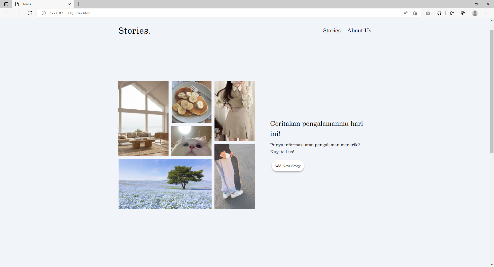
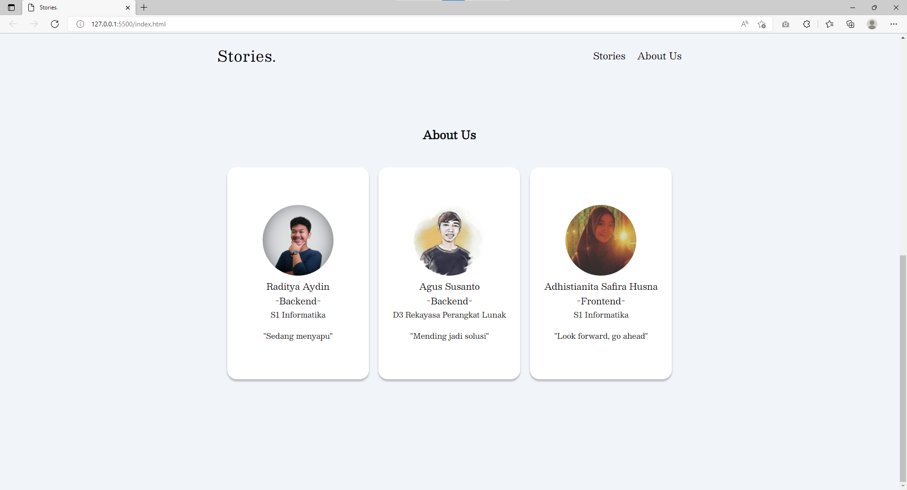
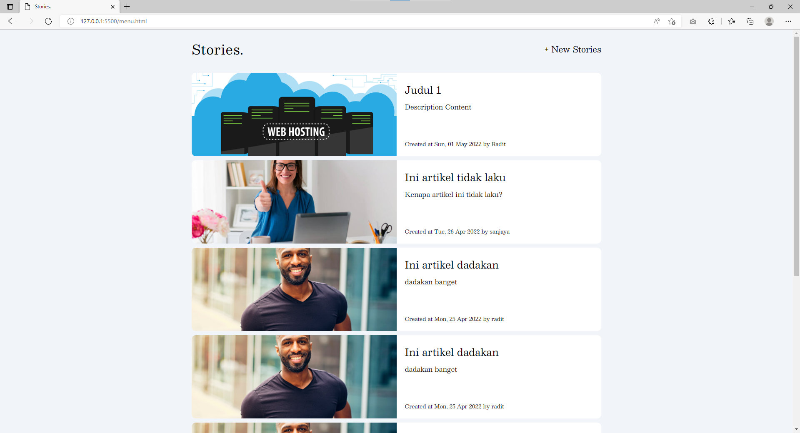
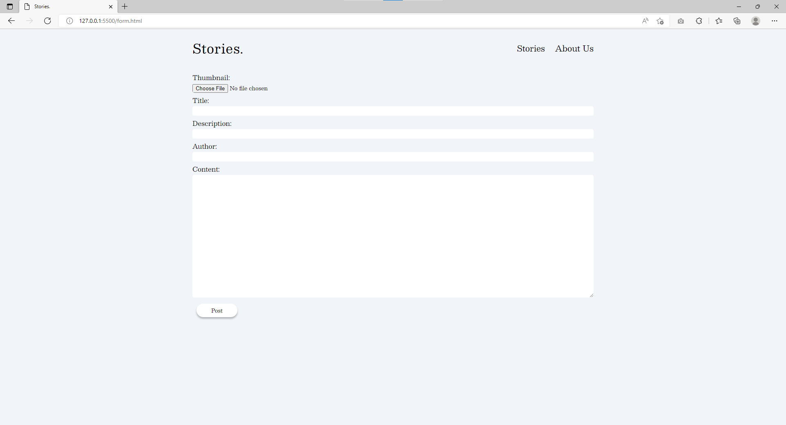
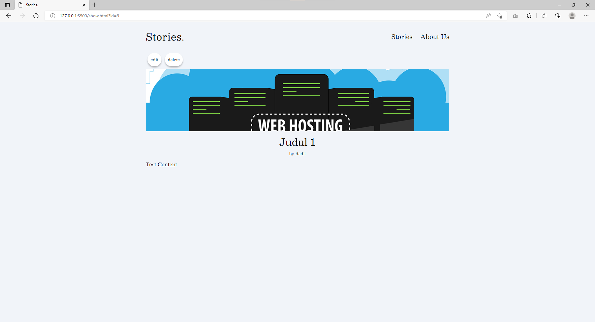

# PREPARATION TASK - SE #

## Screenshot

### Home Page

### About Us

### List Article

### Create Article

### Detail Article

## Tech Stack

### Front-End

* Python 3
* Flask
* SqlLite
* SqlAlchemy

### Back-End

* JavaScript
* HTML
* CSS 3
* Jquery
* Ajax

## Repository

1. [Front End](https://github.com/agussusanto18/se-preparation-task/tree/main/backend)
1. [Back End](https://github.com/agussusanto18/se-preparation-task/tree/main/frontend)

## Contributors

* Agus susanto ([agussusanto18](https://github.com/agussusanto18))
* Raditya Aydin ([Radiit](https://github.com/Radiit))
* Adhistianita Safira Husna ([aadhistii](https://github.com/aadhistii))

## API Documentation

[API Documentation](https://documenter.getpostman.com/view/20640011/UyrDDbMc)

## Video (Explanation and Demo)

https://youtu.be/_xxAtgFqd1k

<!-- ## Live Demo
