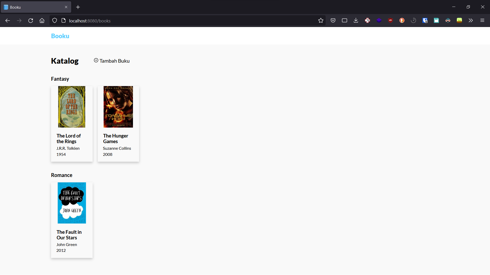
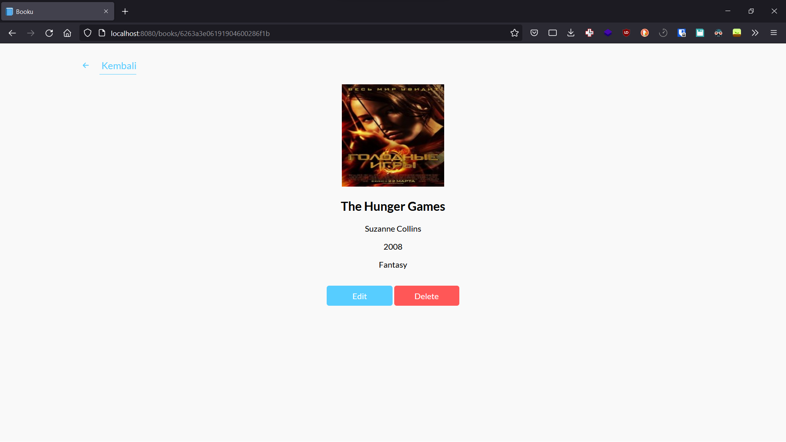
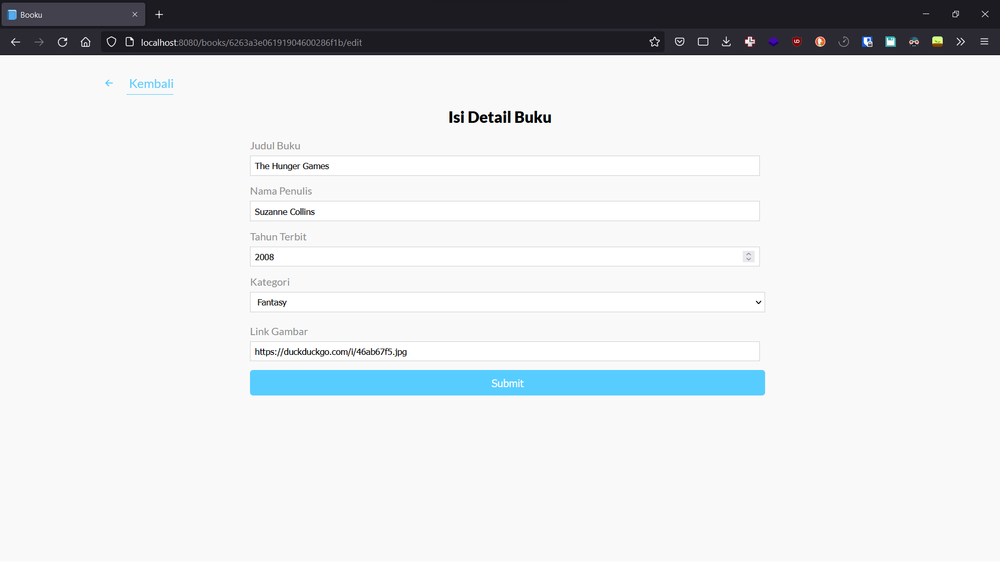

# Muhammad Mufid Utomo

# Muhamad Rafli Susanto

# Luthfi Novra

## Screenshot

## Tech Stack

1. HTML as Markup language
2. Sass as CSS preprocessor
3. Express JS as server engine
4. Mongo DB as database
5. Eta as templating engine

## Repository

1. [Booku](https://github.com/mufidu/booku)
2. [Booku Frontend](https://github.com/raflisusanto/Booku-Frontend)

## Contributors

1. [Muhammad Mufid Utomo](https://github.com/mufidu)
2. [Muhammad Rafli Susanto](https://github.com/raflisusanto)
3. [Luthfi Novra](https://github.com/luthfinovra)

## Live Demo (Optional)

https://booku.mufidu.com/
