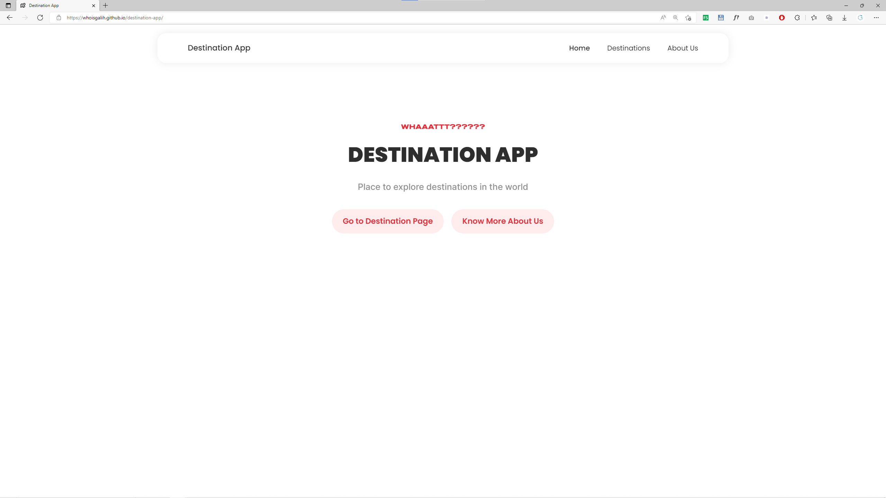
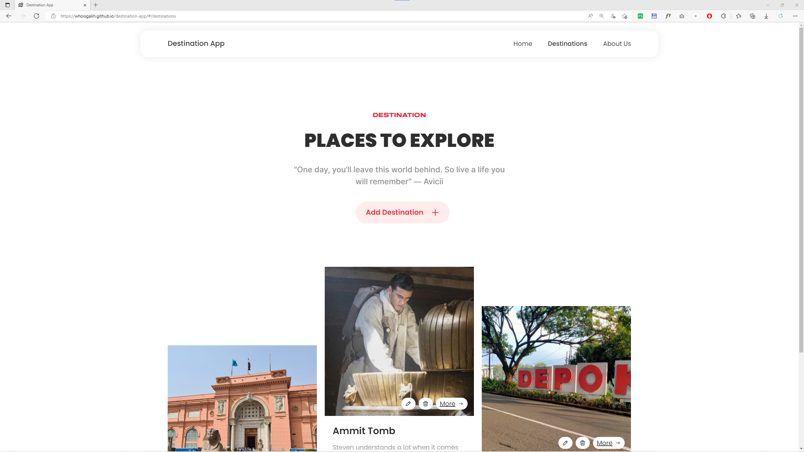
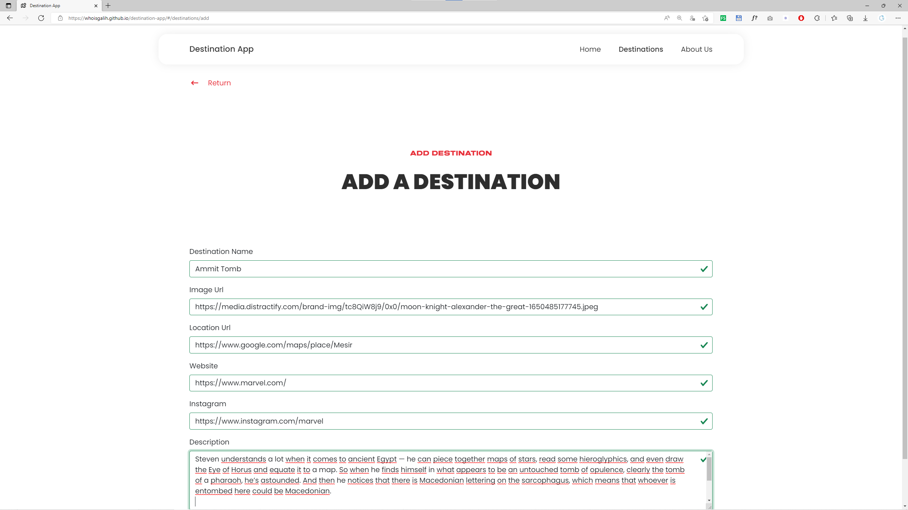
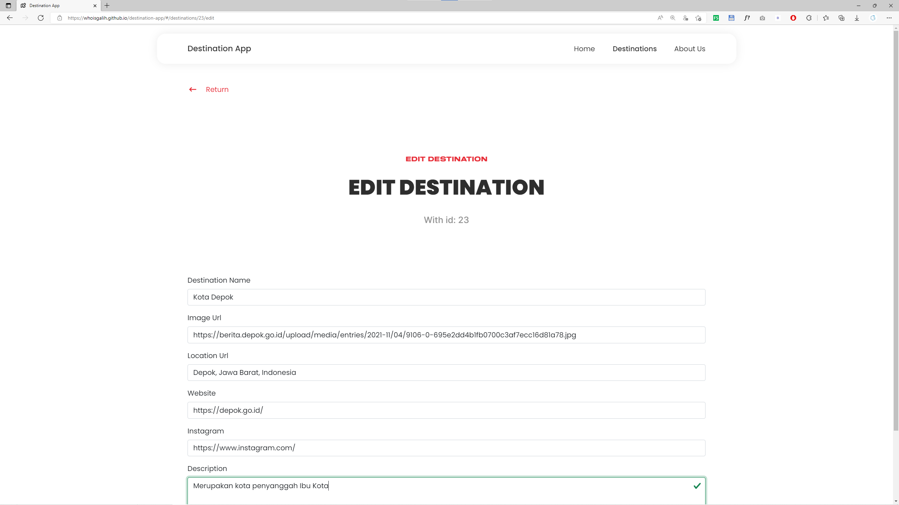
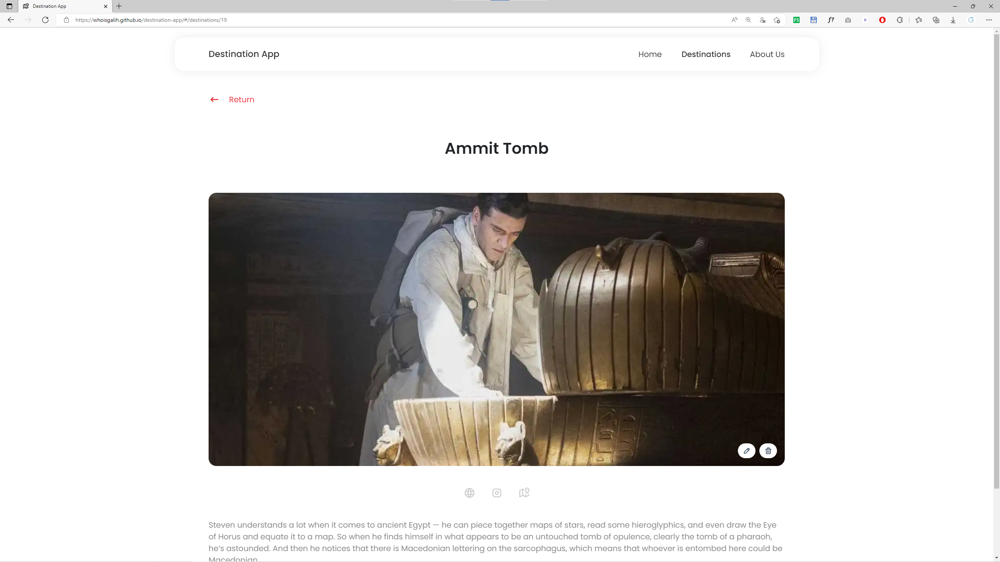
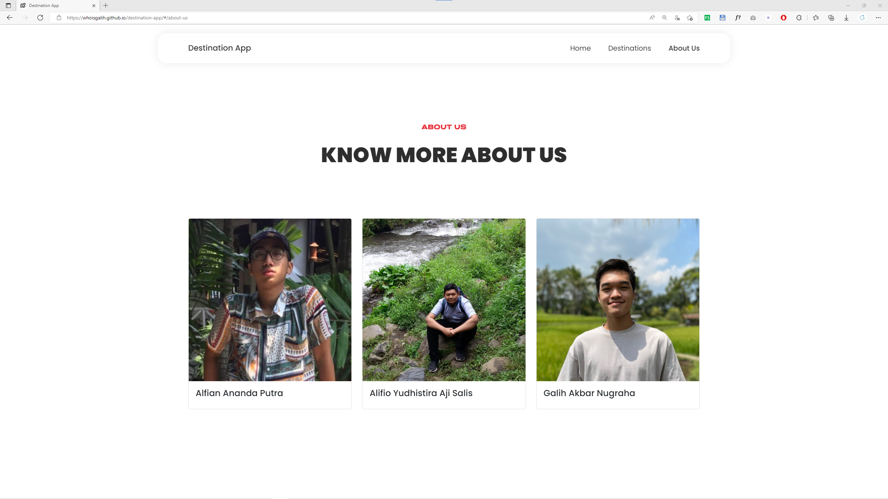

# Alfian Ananda Putra

# Alifio Yudhistira Aji Salis

# Galih Akbar Nugraha

## Screenshot

### Home Page

### Destinations Page

### Add Destination

### Edit Destination

### Destination Page

#### Responsive

.png>)
.png>)

### About Us

## Tech Stack

### Front-End

1. HTML
1. CSS
1. [React](https://reactjs.org/)
1. [Create React App](https://create-react-app.dev/docs/getting-started)
1. [Bootstrap 5](https://getbootstrap.com/docs/5.1/getting-started/introduction/)
1. [React Router Dom](https://v5.reactrouter.com/)
1. [React Masonry CSS](https://github.com/paulcollett/react-masonry-css)
1. [SASS](https://sass-lang.com/)
1. [Github Pages](https://create-react-app.dev/docs/deployment/#github-pages)

### Back-End

1. [HapiJs](https://hapi.dev/)
1. MYSQL
1. Sequelize
1. [imgbb-uploader](https://www.npmjs.com/package/imgbb-uploader)
1. dotenv

## Repository

1. [Front End](https://github.com/whoisgalih/destination-app)
1. [Back End](https://github.com/craftalpian/Destination-App)

## Contributors

1. Alfian Ananda Putra ([craftalpian](https://github.com/craftalpian))
1. Alifio Yudhistira Aji Salis([Xenosians](https://github.com/Xenosians))
1. Galih Akbar Nugraha ([whoisgalih](https://github.com/whoisgalih))

## API Documentation

[API Documentation](https://github.com/craftalpian/Destination-App/blob/main/README.md)

## Video (Explanation and Demo)

### Front End

https://youtu.be/UAnbPp4xx70

### Back End

https://www.youtube.com/watch?v=jVAfwPHeJB4

## Live Demo

Aplikasi **front-end** yang sudah di build terdapat di [Destination App Front-End](https://whoisgalih.github.io/destination-app/). Aplikasi tersebut belum lengkap karena belum memiliki back-end. Silahakan mengunjungi **[Destination App Back-End](https://github.com/craftalpian/Destination-App)** untuk memperloeh aplikasi back-end dan menjalankan di server local dengan alamat `localhost:3000`
